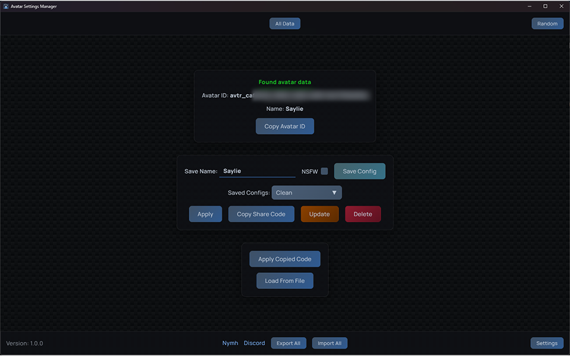
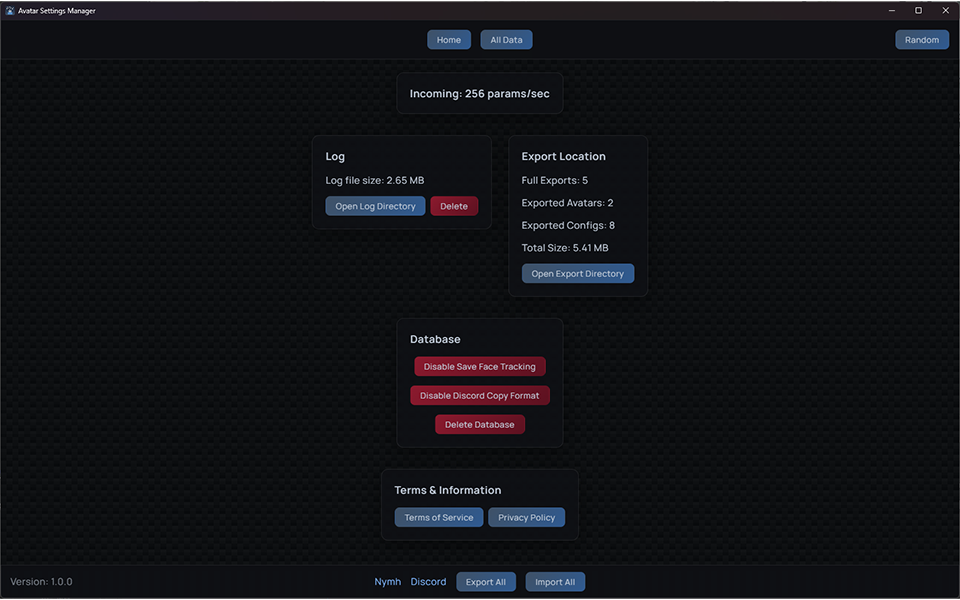
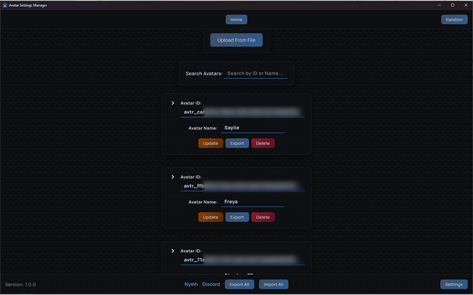
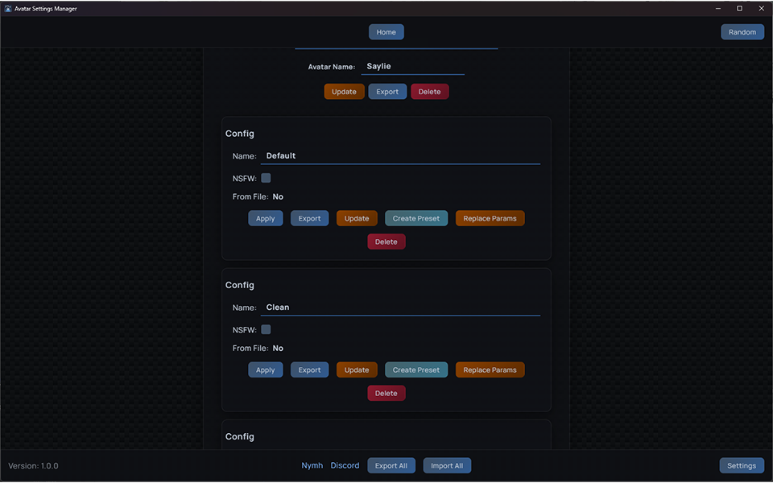

# Avatar Settings Manager

Avatar Settings Manager(ASM) is a free comprehensive lightweight VRChat utility designed to preserve, manage, and share avatar parameter configurations. Never lose your avatar settings again, whether from accidental resets, avatar updates, or switching between variations. All without logging into your VRChat account.

With ASM, you can save complete parameter snapshots, create reusable presets for quick configuration changes, and seamlessly transfer settings between avatar variations. Share your configurations with friends through exported files, allowing them to instantly replicate your setup.

The included Unity package addon enables in-game preset management through your radial menu, allowing on the fly preset management. Best part is it costs 0 avatar parameters.

ASM also works with cloned avatars.

## Features

- Save & Manage Configurations - Store complete parameter snapshots for any avatar
- Preset System - Create multiple presets per avatar for quick switching
- In-Game Preset Control - Unity package addon provides radial menu integration for applying and updating presets in VRChat (uses 0 avatar parameters)
- Cross-Avatar Transfer - Apply settings from one avatar version to another with mismatch warnings
- Import/Export - Export individual configurations or full avatar setups via file or via share code
- Batch Operations - Export and import all configurations at once
- Avatar Mismatch Protection - Warns when applying configs to different avatars to prevent unexpected results
- NSFW Filtering - Mark configs as NSFW
- Clone Avatar Support - Works seamlessly with cloned avatars
- Parameter Monitoring - Watches VRChat data for real-time changes
- Random Button - Randomize avatar parameters, read more [here](https://github.com/Nymmh/vrc-avatar-settings-manager/wiki/FAQ#what-does-the-random-button-do)

## Getting Started

- Currently only windows is supported
- Download and install the latest version from [here](https://github.com/Nymmh/vrc-avatar-settings-manager/releases) or on [Jinxxy](https://jinxxy.com/Nymh/ASM)
- (Optional) Download the ASM unity package from [here](https://github.com/Nymmh/vrc-avatar-settings-manager/releases) or on [Jinxxy](https://jinxxy.com/Nymh/ASM)
- - Add the ASM package to your avatar's root and upload
- - ASM must be running for the preset menu to work
- Run ASM
- Launch VRChat

## Why am I getting "Windows protected your PC"?

Windows may show a "Windows protected your PC" message because the installer is currently unsigned.

To continue, click More info → Run anyway.

ASM does not contain malware; this warning appears because the installer is not digitally signed.

You can review the scan result on [VirusTotal](https://www.virustotal.com/gui/file/b8eda1f1ab78a4787174f0837b7524881888e491088bd396da8a4e4e51920432/detection).

For common questions, see the [FAQ](https://github.com/Nymmh/vrc-avatar-settings-manager/wiki/FAQ).

## Building from source

View the doc [here](https://github.com/Nymmh/vrc-avatar-settings-manager/wiki/Build-from-source) to build from source

## Bug Reports & Feature Requests

Bug reports & feature requests can be created as a [Github Issue](https://github.com/Nymmh/vrc-avatar-settings-manager/issues) or in the [Discord](https://discord.gg/rcCCkbDsY3).

## Is ASM against VRChat TOS?

No, ASM is not against VRChat TOS.

ASM does not modify your game in anyway and uses features and data provided by VRChat. It is not a mod or cheat.

## License

ASM is proprietary software with source available for reference. By using ASM, you agree to the [End-User License Agreement (EULA)](https://github.com/Nymmh/vrc-avatar-settings-manager/wiki/Terms).

## Privacy

ASM is committed to protecting your privacy. All avatar configurations, presets, and settings are stored locally on your computer. ASM does not collect, transmit, or share your personal data. The only external network request made is to check for software updates from the [official GitHub repo](https://github.com/Nymmh/vrc-avatar-settings-manager/).

**Key Privacy Features:**

- ✅ All data stored locally on your device
- ✅ No external data transmission (except update checks)
- ✅ No analytics or tracking
- ✅ Complete user control over all data
- ✅ No account creation or login required
- ✅ Source code available for transparency

For complete details, see our [Privacy Policy](https://github.com/Nymmh/vrc-avatar-settings-manager/wiki/Privacy-Policy).

## For Avatar Creators

Avatar creators are welcome to include ASM exported configurations and presets with their commercial avatar products, along with the ASM Unity package. When doing so, please provide attribution by:

- Crediting Avatar Settings Manager in your documentation or credits
- Linking to the ASM download page: [https://github.com/Nymmh/vrc-avatar-settings-manager](https://github.com/Nymmh/vrc-avatar-settings-manager) or [https://jinxxy.com/Nymh/ASM](https://jinxxy.com/Nymh/ASM)
- Do not distribute the ASM installer

This allows your customers to easily load and use the configurations you've created. For more details, see Section 3.2 of the [EULA](https://github.com/Nymmh/vrc-avatar-settings-manager/wiki/Terms#32-commercial-use-of-exported-configurations).

## Screenshots

### Main

### Settings

### All Data

Thank you, [Bobatea](https://tiplink.dev/), [Warm Truffle](https://x.com/animestuffzs), [Kas3y](https://www.youtube.com/@Kas3y_OV), [bAbe](https://x.com/AbehammVR), [Tamara](https://www.twitch.tv/tamara_vr), [Crossbarrel](https://x.com/CrossbarrelVR), [CrunchyFrajs](https://jinxxy.com/CrunchyFrajs), [Remi](https://jinxxy.com/AvatarsByRemi), [Angel Dust](https://x.com/Angel_DustVR), [Vexi](https://x.com/Vexi_VR), [Omega](https://x.com/The_OmegaTV), [LynxJinx](https://x.com/LynxJinxxy), and everyone who helped me.

[List of avatars used in demo video](https://github.com/Nymmh/vrc-avatar-settings-manager/wiki/Avatar-List).
