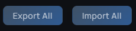
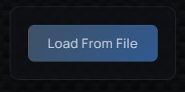
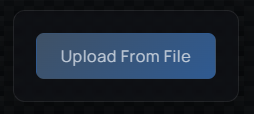
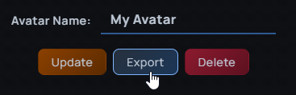
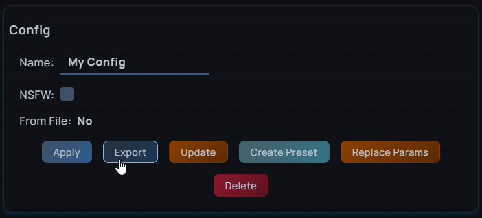
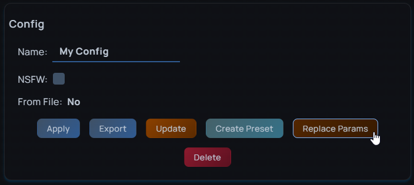

# Detailed Export & Import Guide

This guide explains how to use ASM's export and import features to share configurations and back up your data.

## Understanding the Data Types

- Configuration (Config) - A saved snapshot of avatar parameters for a specific avatar, including name, NSFW flag, parameter values and preset's
- Avatar Data - All configurations and presets associated with a single avatar ID
- Export All - Complete backup of everything in ASM's database (all avatars, configs, and presets)

## Export All & Import All

Located in the footer of ASM:

- Export All - Creates a complete backup file containing all avatars, configurations, and presets stored in ASM
- Import All - Imports data from an Export All file without overwriting existing entries. Only new data is added, making it safe for merging configurations.

## Main Screen

### Load From File

Imports and immediately applies a configuration to your current avatar:

1. Select a config export file
2. If the avatar ID doesn't match your current avatar, you'll receive a warning as this may cause unexpected results.
3. If marked as NSFW, you'll be prompted to confirm
4. The configuration is applied to your current avatar
5. You'll be asked if you want to save this config to ASM

## All Data Screen

### Upload From File

Imports avatar data or configurations without applying them:

- Accepts both **Avatar Export** and **Config Export** files
- Preserves the original avatar ID from the file
- Creates avatar entries automatically if they don't exist
- On name conflicts, you can choose to:
  - Overwrite the existing entry
  - Create a new entry with an auto-generated name

**Use case:** Importing shared configurations from friends or backing up data without applying settings immediately.

### Avatar Export

Exports all data for a specific avatar:

- Includes all configurations for that avatar ID
- Includes all presets associated with those configurations
- Can be imported using **Upload From File**

**Use case:** Sharing your complete avatar setup with friends or creating per-avatar backups.

### Config Export

Exports a single configuration:

- You'll be prompted whether to include associated presets
- Can be imported via **Upload From File** or **Load From File**
- Compatible with **Replace Params** feature

**Use case:** Sharing specific avatar configurations or creating templates for similar avatars.

### Replace Params

Updates an existing configuration's parameters from a Config Export file:

- Replaces only the parameter values
- Preserves the configuration name, avatar ID, and other data
- Presets are not affected

**Use case:** Updating a saved config with new parameter values without creating a duplicate entry.
